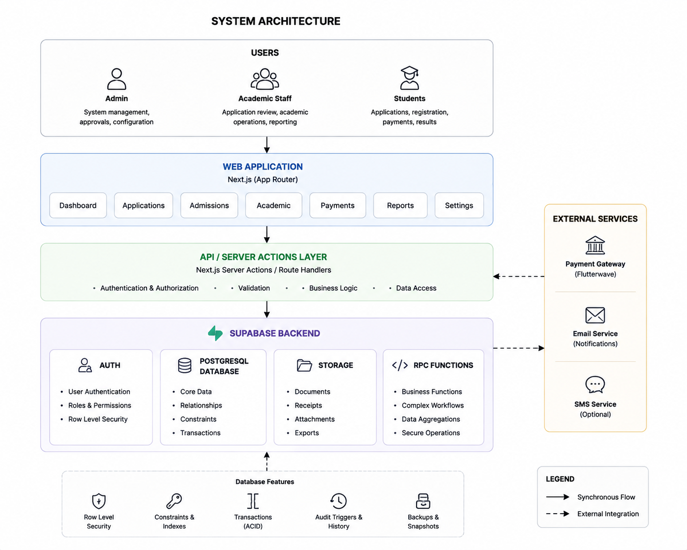
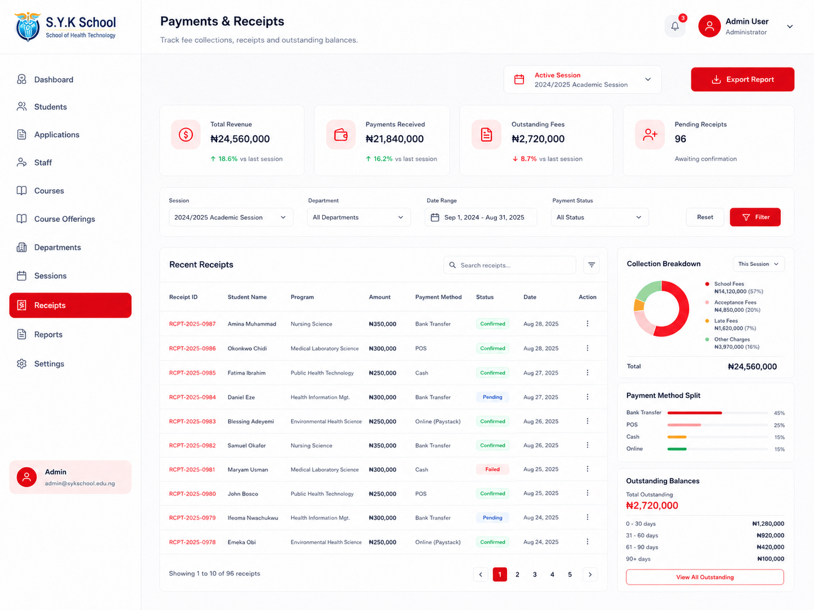

# Institutional Management Platform

A full-stack institutional management platform for managing connected workflows across admissions, student administration, academics, staff operations, and finance.

The platform covers the journey from an initial application through review and admission, applicant-to-student conversion, academic-session registration, course management and registration, fee accounts, payments, and administrative oversight.

What became most valuable to me while working on this project was not simply adding more features.

I eventually went back through the system and started asking different questions:

- What happens if the same operation is submitted twice?
- What happens if two users modify the same state at the same time?
- Can part of a workflow succeed while another part fails?
- Which rules belong in the UI, API, or database?
- Who should actually be allowed to perform sensitive operations?
- How should mistakes be corrected without destroying history?

That review led to a broader hardening of the platform around data integrity, authorization, transactions, concurrency, idempotency, and auditability.

---

## Platform Preview

<!-- Replace with your strongest dashboard / platform screenshot -->


---

## Core Capabilities

### Admissions & Student Lifecycle

- Application submission and document handling
- Application review and admission decisions
- Duplicate-application protection
- Applicant-to-student conversion
- Student records and academic history
- Individual academic-session registration
- Bulk academic-session registration

### Academic Operations

- Academic-session and semester management
- Programme management
- Course management
- Course offerings by session, semester, programme, and level
- Lecturer assignment
- Publishing of course offerings
- Student course registration
- Duplicate-enrolment protection

### Staff & Access Control

- Academic and non-academic staff management
- Role-based access
- Unit / department-aware authorization
- Server-side authorization guards
- Separation of authentication and authorization

### Finance

- Programme fee plans
- Student fee accounts
- Payment processing and review
- Approved-payment balance updates
- Rejection workflows
- Controlled payment reversals
- Financial audit history

---

## End-to-End Workflow

The platform is easier to understand as a connected institutional lifecycle rather than a collection of unrelated CRUD pages.

```text
Applicant
   ↓
Application
   ↓
Application Review
   ↓
Admission Decision
   ↓
Applicant → Student Conversion
   ↓
Student Record
   ↓
Academic Session Registration
   ↓
Fee Account
   ↓
Course Registration
   ↓
Ongoing Academic, Financial
and Administrative Operations
```

<!-- Add institutional lifecycle diagram -->


---

## Architecture Snapshot

### Frontend

- Next.js 15
- React
- TypeScript
- Tailwind CSS

### Application Layer

- Next.js API routes
- Server-side validation
- Authentication guards
- Authorization guards
- Business-workflow coordination

### Data Layer

- PostgreSQL
- Supabase
- PostgreSQL functions / RPCs
- Database migrations
- Constraints and indexes

### Supporting Services

- Supabase Auth
- Supabase Storage
- Redis
- Git / GitHub

At a high level:

```text
             Users
               ↓
        Next.js Interface
               ↓
   Authentication / Authorization
               ↓
           API Layer
               ↓
       Business Workflows
               ↓
     PostgreSQL / Supabase
       ↙        ↓        ↘
Constraints    RPCs    Audit Data
```

<!-- Add architecture diagram -->



---

## Key Engineering Decisions

### Applicant conversion is treated as a workflow

Accepting an application does not simply change a status.

The conversion process creates the related records required for the applicant to become an active student:

```text
Accepted Application
        ↓
Profile
        ↓
Student Record
        ↓
Initial Registration
        ↓
Fee Account
```

These records depend on each other and should not be left partially created.

---

### Single and bulk registration have different failure behaviour

A single registration should fail when an essential requirement is missing.

For example:

```text
Student
→ No programme fee plan
→ Registration fails
```

Bulk registration behaves differently.

```text
Valid student
→ Registered
→ Fee account created

Invalid student
→ Skipped
→ Reason returned

Remaining valid students
→ Continue
```

This allows a batch operation to continue without hiding failures.

---

### Courses and course offerings are separate concepts

A **course** defines what is taught.

A **course offering** defines when and for whom it is available.

```text
Course
   ↓
Academic Session
   ↓
Semester
   ↓
Programme / Level
   ↓
Lecturer
   ↓
Published Offering
```

This avoids duplicating course records every academic period.

---

### Important business rules survive the frontend

Frontend validation improves the user experience, but critical rules are also protected closer to the data.

The database uses:

- Foreign keys
- Unique constraints
- Check constraints
- Transactional functions

Examples include preventing duplicate:

- Applications
- Student session registrations
- Course enrolments
- Fee accounts

---

### Critical operations are transactional

Some actions represent one business operation even though they require several database writes.

For those workflows, related changes should either all succeed or all fail.

```text
BEGIN

Validate
Lock required records
Perform related changes
Recalculate dependent state
Record audit information

COMMIT
```

If an important step fails, the operation rolls back instead of leaving partial state behind.

---

### Concurrency is handled deliberately

For workflows where multiple users can modify the same data, PostgreSQL row locking is used where appropriate:

```sql
SELECT ... FOR UPDATE;
```

This became especially important in financial workflows where concurrent approvals could otherwise produce incorrect balances.

---

### Financial history is corrected rather than erased

Approved financial records are not simply deleted when a mistake is discovered.

Instead:

```text
Approved Payment
       ↓
Correction Required
       ↓
Controlled Reversal
       ↓
Balance Recalculated
       ↓
History Preserved
```

The original approval remains available together with the reversal reason, user, and timestamp.

---

## Selected Screenshots

I keep the README limited to a few representative screens. More detailed screenshots are included in the supporting documentation.

### Applications & Review


### Student Session Registration


### Course Offerings


### Course Registration


### Payment Operations



---

## What I Learned

The biggest lesson from this project was that a feature working normally does not necessarily mean the system is reliable.

Some of the most useful work happened after the features were already functional.

A few principles I am taking away from the project:

- Business rules need a clear enforcement layer.
- Database design is part of application design.
- Authentication and authorization solve different problems.
- Transactions matter when several writes represent one action.
- Race conditions need deliberate handling.
- Idempotency should be designed rather than assumed.
- Financial systems need strong auditability.
- Corrections should preserve important history.
- Existing systems should be understood before they are rewritten.
- The most interesting engineering questions often appear after the happy path already works.

---

## Documentation & Case Studies

The deeper technical details live under `/docs`.

### Core Documentation

- [System Architecture](./docs/architecture.md)
- [Core Workflows](./docs/workflows.md)
- [Reliability & Security](./docs/reliability-and-security.md)

`workflows.md` covers:

- Applications and application review
- Applicant → student conversion
- Single session registration
- Bulk session registration
- Courses and course offerings
- Course registration
- Fee accounts and payment operations

### Engineering Case Studies

- [Platform Hardening](./docs/case-studies/platform-hardening.md)
- [Registration & Data Integrity](./docs/case-studies/registration-integrity.md)
- [Financial Workflow Hardening](./docs/case-studies/financial-workflow.md)

---

## Project Status

The main platform workflows have now gone through a broader engineering review focused on:

- Data integrity
- Authorization
- Transaction safety
- Duplicate protection
- Concurrency
- Financial consistency
- Auditability
- Failure handling

###NOTE: I consider the main hardening phase complete.

At this point, the repository serves both as the implementation of the platform and as a record of the engineering decisions and lessons that came from building, reviewing, and improving a larger system.