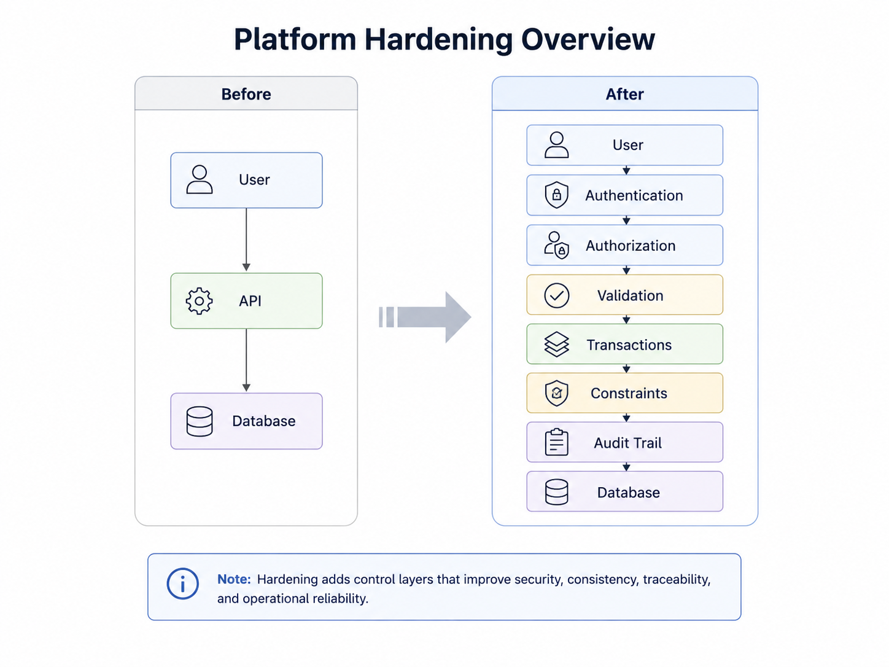

# Reverse Engineering & Hardening an Institutional Platform

## Context

The Institutional Management Platform already had its main workflows in place across admissions, student management, academic operations, staff access, course registration, and finance.

The next phase was not about adding more features.

It was about asking whether the existing workflows were actually safe when something went wrong.

The review focused on questions such as:

- What happens when the same request is submitted twice?
- Can a multi-step workflow partially succeed?
- Can two users modify the same state at the same time?
- Is authorization too broad?
- Can financial history be corrected without being erased?

That shifted the work from feature development toward system hardening.


---

## Review Approach

I reviewed the platform by following complete business workflows rather than fixing isolated files.

```text
Understand the Business Process
        ↓
Trace UI and Server Flow
        ↓
Inspect Database Relationships
        ↓
Identify Business Rules
        ↓
Look for Failure Cases
        ↓
Decide Where the Rule Belongs
        ↓
Implement and Test
```

This helped separate frontend issues from deeper problems in authorization, data modelling, transactions, and database integrity.

---

# Main Areas Hardened

## 1. Duplicate Protection

Several records should logically exist only once.

Examples include:

```text
NIN + Programme + Session
```

for applications, and:

```text
Student + Session
```

for academic registration.

The frontend can prevent accidental duplicate submissions, but the database also needs to guarantee that invalid duplicates cannot be stored.

That led to stronger use of unique constraints and controlled conflict handling.

---

## 2. Applicant-to-Student Conversion

Converting an accepted applicant is not one database update.

It creates or connects several related records:

```text
Accepted Application
        ↓
Profile
        ↓
Student
        ↓
Initial Registration
        ↓
Fee Account
```


The important reliability question was:

> What happens if one of those steps succeeds and the next one fails?

The conversion was treated as one business operation so the platform does not intentionally leave an applicant only partially converted.

---

## 3. Session Registration Integrity

Single and bulk registration need different failure behaviour.

### Single registration

If the required programme fee plan is missing:

```text
Registration Fails
```

The system does not create the registration without the related fee account.

### Bulk registration

A bad record should not necessarily stop the whole batch.

```text
Valid Student
→ registration + fee account created

Invalid Student
→ skipped
→ reason returned

Remaining Students
→ continue
```

This was an important design decision:

> Similar operations can require different failure behaviour depending on the business context.

---

## 4. Course vs Course Offering

A course represents the permanent academic subject.

A course offering represents when and for whom that course is available.

```text
Course
   ↓
Course Offering
   ├── Session
   ├── Semester
   ├── Programme
   ├── Level
   └── Lecturer
```

Keeping those concepts separate avoids duplicating permanent course records every academic period and makes course-registration rules easier to enforce.

---

## 5. Authorization Beyond Broad Roles

One issue discovered during the review was authorization that technically worked but was too broad.

A generic:

```text
non_academic_staff
```

role should not automatically provide access to bursary operations.

The rule was tightened to consider institutional responsibility:

```text
Authenticated User
        ↓
Role
        ↓
Staff Record
        ↓
Institutional Unit
        ↓
Allowed Operation
```

For payment review, this means administrators or authorized bursary personnel rather than every non-academic staff member.

---

## 6. Financial Consistency

The payment workflow was one of the clearest examples of why related database changes should not be treated as independent calls.

A financial review may need to:

```text
Validate Payment
      ↓
Approve / Reject
      ↓
Recalculate Approved Total
      ↓
Update Fee Account
      ↓
Write Audit Information
```

If one step succeeds and another fails, the platform can become inconsistent.

The sensitive financial operations were moved into transactional PostgreSQL functions so they succeed or roll back as one unit.

---

## 7. Concurrency Protection

Two authorized reviewers can act on the same payment at nearly the same time.

Without protection, both can make decisions from the same stale state.

PostgreSQL row locking is used for shared financial state:

```sql
SELECT ...
FOR UPDATE;
```


One transaction completes while the other waits and then re-evaluates the updated state.

This protects a class of race conditions that normal manual testing may never expose.

---

## 8. Financial Corrections

Approved financial history should not disappear when a mistake needs correction.

Instead of deleting or rewriting an approved payment:

```text
Approved
   ↓
Correction Required
   ↓
Reversed
```

The original approval remains, while the reversal records:

- who reversed it
- when it was reversed
- why it was reversed

The account is then recalculated from payments that remain approved.

This preserves the difference between:

```text
Current Financial State
```

and:

```text
What Actually Happened
```

---

# Where the Rules Live

The hardening work also clarified where different rules belong.

| Layer | Main Responsibility |
|---|---|
| Frontend | Interaction and immediate feedback |
| API / Server | Request validation and authorization |
| Database constraints | Permanent invariants |
| PostgreSQL RPCs | Atomic multi-step operations |
| Row locking | Shared-state concurrency protection |
| Audit fields | Historical accountability |

The goal was not to move everything into PostgreSQL.

It was to place important rules in the layer that can enforce them reliably.

---

# Before and After

The biggest change was not necessarily visible in the UI.

### Earlier

```text
User Action
    ↓
API Request
    ↓
Update Database
    ↓
Feature Works
```

### Hardened

```text
User Action
    ↓
Authenticate
    ↓
Authorize
    ↓
Validate Current State
    ↓
Protect Concurrent State
    ↓
Perform Atomic Operation
    ↓
Enforce Database Invariants
    ↓
Record Audit Information
```



The interface may look almost the same, but the behaviour is more predictable when unusual conditions occur.

---

# Outcome

The hardening work strengthened:

- duplicate protection
- applicant conversion
- single and bulk session registration
- fee-account creation
- course-registration integrity
- staff authorization
- payment transactions
- concurrent payment review
- financial reversal
- audit history

The main shift in thinking was from:

```text
Does the feature work?
```

to:

```text
What can fail?
Who can trigger it?
Can it happen twice?
Can it happen concurrently?
Can it partially succeed?
How should it be corrected?
What history must remain?
```

That became a much more useful way to evaluate the platform.

---

# Related Documentation

- [System Architecture](../architecture.md)
- [Core Workflows](../workflows.md)
- [Reliability & Security](../reliability-and-security.md)

## Related Case Studies

- [Registration Integrity](./registration-integrity.md)
- [Financial Workflow Hardening](./financial-workflow.md)
