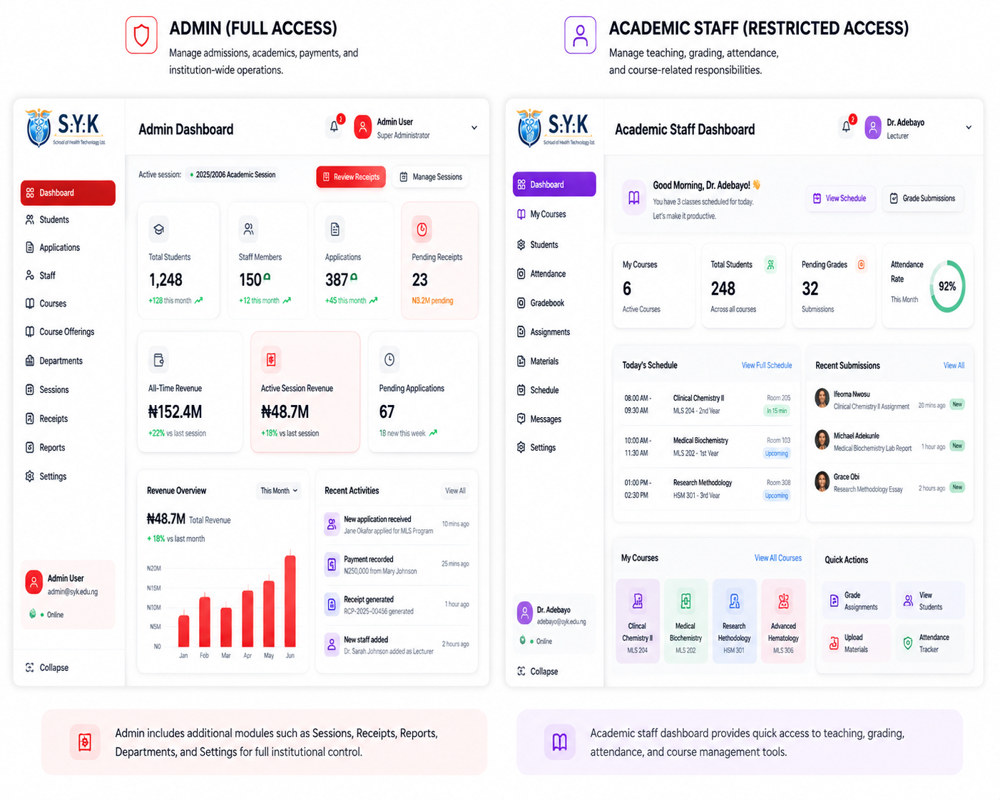

# Reverse Engineering & Hardening an Institutional Platform

## Context

The Institutional Management Platform already had its major workflows in place across admissions, student management, academic operations, course registration, staff administration, and finance.

At that point, my goal was no longer to keep adding features.

I wanted to understand how reliable the existing system actually was.

A feature working through the normal UI does not necessarily mean the underlying workflow is safe. So I went back through the platform and started reviewing it from the business process down to the database.

Instead of only asking:

> Does this work?

I started asking:

> What assumptions does this workflow make?

> What happens if the request is repeated?

> What happens when two users act at the same time?

> Can one part succeed while another fails?

> Who should actually be allowed to perform this operation?

> What happens when a mistake needs to be corrected?

That changed the way I approached the platform.

---

## Platform Scope

The review covered connected workflows across several areas:

- Applications and admission review
- Applicant-to-student conversion
- Student records
- Academic sessions
- Single student session registration
- Bulk student session registration
- Programmes
- Courses
- Course offerings
- Course registration
- Staff roles and authorization
- Programme fee plans
- Student fee accounts
- Payment review
- Financial reversals and audit history

<!-- IMAGE PLACEHOLDER: Platform overview -->



---

## How I Approached the Review

Rather than opening random files and fixing whatever looked suspicious, I started following complete business workflows.

My process became:

```text
Understand the Business Process
            ↓
Trace the UI Action
            ↓
Trace the API / Server Logic
            ↓
Inspect Database Relationships
            ↓
Identify Existing Business Rules
            ↓
Look for Failure Cases
            ↓
Decide Where the Rule Should Live
            ↓
Implement
            ↓
Test
            ↓
Document the Decision
```

This was important because some problems that looked like frontend issues were actually database-design issues, while others were authorization or workflow problems.

---

# Areas I Hardened

## 1. Application and Registration Integrity

Several workflows depend on a record being logically unique.

Examples include:

```text
Applicant
+
Programme
+
Academic Session
```

and:

```text
Student
+
Academic Session
```

I did not want duplicate prevention to depend only on the frontend checking whether a record already existed.

The database also needed to protect the rule.

This led to using database uniqueness constraints and controlled conflict handling for important institutional records.

The general principle became:

> The UI can prevent an accidental duplicate.  
> The database must prevent an invalid duplicate.

---

## 2. Applicant-to-Student Conversion

An accepted application does not become a student through one simple update.

The conversion connects several records:

```text
Accepted Application
        ↓
Profile
        ↓
Student
        ↓
Initial Registration
        ↓
Fee Account
```

These records depend on each other.

The important question was therefore not:

> Can I create these records?

It was:

> What happens if record three succeeds and record four fails?

That pushed the workflow toward treating conversion as one business operation rather than several unrelated database writes.

<!-- IMAGE PLACEHOLDER: Conversion workflow -->


---

## 3. Single and Bulk Session Registration

The session-registration workflow exposed an interesting business distinction.

### Single registration

When registering one student, the system validates that the required programme fee configuration exists.

If it does not:

```text
Registration fails
```

rather than creating an academic registration without the expected fee account.

### Bulk registration

Bulk registration needs different behaviour.

If twenty students are selected and one student is missing required configuration, failing all twenty is not always the correct business outcome.

Instead:

```text
Valid Student
→ Registration created
→ Fee account created

Invalid Student
→ Skipped
→ Reason returned

Remaining Students
→ Continue processing
```

This was an important lesson for me:

> Similar operations do not always need identical failure behaviour.

The correct behaviour depends on the business meaning of the operation.

---

## 4. Courses vs Course Offerings

Another important modelling decision was keeping courses separate from course offerings.

A course describes:

```text
What is taught
```

A course offering describes:

```text
When it is taught
Who it is available to
Who teaches it
```

An offering can therefore connect a course to:

- Academic session
- Semester
- Programme
- Level
- Lecturer
- Publication state

This avoids duplicating permanent course records every academic period.

```text
Course
   ↓
Course Offering
   ├── Session
   ├── Semester
   ├── Programme
   ├── Level
   └── Lecturer
```

This separation also makes course-registration rules easier to reason about.

---

## 5. Authorization Beyond Roles

One issue I found during the review was authorization that was technically working but too broad.

For example, allowing:

```text
non_academic_staff
```

to perform a bursary operation meant every user with that broad role could potentially access the workflow.

The authorization model was tightened to consider institutional responsibility:

```text
Authenticated User
        ↓
Role
        ↓
Staff Record
        ↓
Unit
        ↓
Allowed Operation
```

For financial review, this means distinguishing bursary personnel from unrelated non-academic staff.

This reinforced an important distinction:

> Authentication tells me who the user is.

> Authorization tells me whether that user should be allowed to perform this particular operation.

---

## 6. Financial Workflow Consistency

The payment workflow was one of the clearest examples of why multiple independent database calls can become dangerous.

The earlier pattern could conceptually do:

```text
Approve Payment
      ↓
Update Receipt
      ↓
Update Fee Account
```

If the first update succeeded and the second failed, financial state could become inconsistent.

The workflow was moved into transactional PostgreSQL functions so the related operation could be treated atomically.

```text
BEGIN

Lock relevant records

Validate current state

Approve / Reject payment

Recalculate financial totals

Update account

Store audit information

COMMIT
```

If an important step fails:

```text
ROLLBACK
```

The result is either a completed financial operation or no financial operation.

Not half of one.

---

## 7. Concurrency

Another question was:

> What happens if two authorized users review the same payment at almost exactly the same time?

Both could potentially read the same previous state before either update completed.

For shared financial state, I used PostgreSQL row locking:

```sql
SELECT ...
FOR UPDATE;
```

The first transaction locks the relevant row while it performs the operation.

A second transaction trying to modify the same state must wait and then re-evaluate the updated state.

This protects against race conditions that are difficult to reproduce through ordinary manual testing.

<!-- IMAGE PLACEHOLDER: Row locking / transaction -->


---

## 8. Financial Corrections

Initially, an approved payment could potentially be treated like an ordinary record.

That is dangerous for financial history.

If an approved transaction was incorrect, deleting it would answer:

```text
What is the balance now?
```

but lose the answer to:

```text
What actually happened?
```

The workflow therefore uses controlled reversal.

```text
Approved
   ↓
Correction Required
   ↓
Reversed
```

The original approval remains available together with:

- Original reviewer
- Original approval time
- Reversing user
- Reversal time
- Reversal reason

The account is recalculated from the financial records that remain approved.

The correction therefore changes current financial state without erasing history.

---

# Where I Put Business Rules

One of the strongest lessons from the review was that not every rule belongs in the same place.

I now think about the layers roughly like this:

| Layer | Main Responsibility |
|---|---|
| Frontend | User interaction and immediate feedback |
| API | Request validation and authorization |
| Database constraints | Permanent data invariants |
| PostgreSQL RPCs | Atomic multi-step operations |
| Row locking | Concurrent shared-state protection |
| Audit fields | Historical accountability |

For example:

### Frontend

> Reversal reason is required.

### API

> This user is not authorized to reverse payments.

### Database

> A reversed payment must contain valid reversal audit information.

Each layer protects a different concern.

---

# Before and After

The biggest difference was not necessarily visible in the UI.

### Earlier mindset

```text
User performs action
        ↓
API receives request
        ↓
Update database
        ↓
Feature works
```

### Hardened mindset

```text
User performs action
        ↓
Authenticate
        ↓
Authorize
        ↓
Validate business request
        ↓
Check current state
        ↓
Protect concurrent state
        ↓
Perform atomic operation
        ↓
Protect database invariants
        ↓
Record audit information
        ↓
Return controlled result
```

<!-- IMAGE PLACEHOLDER: Before vs after -->


The interface may look almost identical.

The difference is in how much more predictable the system becomes when unusual conditions occur.

---

# Trade-offs

Not every rule was moved into PostgreSQL.

Doing that would make the application unnecessarily difficult to understand and maintain.

I also did not try to redesign every CRUD screen simply because I was reviewing the platform.

The goal was to strengthen areas where failure would actually matter.

That meant prioritizing:

- Data integrity
- Multi-record workflows
- Authorization boundaries
- Financial state
- Duplicate prevention
- Concurrency
- Audit history

while leaving straightforward application logic at the application layer.

This helped avoid turning "hardening" into an unnecessary rewrite.

---

# Outcome

By the end of the review, the platform had stronger protection around:

- Duplicate institutional records
- Applicant conversion
- Single session registration
- Bulk session registration
- Fee-account creation
- Course-registration integrity
- Staff authorization
- Financial transactions
- Concurrent payment review
- Payment state transitions
- Financial reversals
- Audit history

More importantly, I came away with a different way of evaluating software.

A system is not reliable simply because the happy path works.

For the workflows that matter, I now try to understand:

```text
What should happen?
What can go wrong?
Who can trigger it?
Can it happen twice?
Can it happen concurrently?
Can it partially fail?
How can it be corrected?
What history should remain?
```

Those questions became more useful to me than simply asking whether another feature could be added.

---

# Related Documentation

- [System Architecture](../architecture.md)
- [Core Workflows](../workflows.md)
- [Reliability & Security](../reliability-and-security.md)

## Related Case Studies

- [Registration & Data Integrity](./registration-integrity.md)
- [Financial Workflow Hardening](./financial-workflow.md)

---

## Visual Placeholders

```text
docs/assets/
├── screenshots/
│   └── platform-overview.png
│
└── diagrams/
    ├── applicant-conversion.png
    ├── row-locking.png
    └── platform-hardening-before-after.png
```

<!-- Delete this section once the final visuals have been added. -->