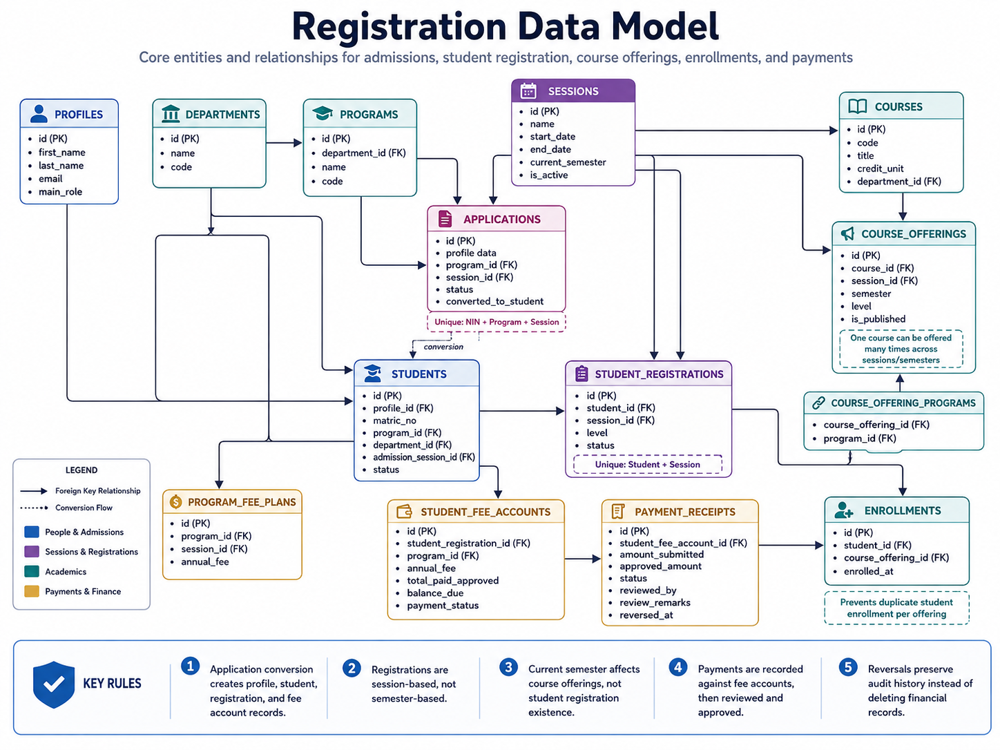

# Registration & Academic Data Integrity

## Context

Registration looks simple in the interface, but it sits between several important records.

A successful student registration determines:

- the academic session
- the student's programme context
- the fee plan that applies
- the fee account that should exist
- the academic context later used for course registration

That means registration cannot be treated as an isolated insert.

The core question became:

> What records must remain consistent whenever a student is registered?

---

## Registration Model

A student exists independently from an academic-session registration.

```text
Student
   ↓
Student Registration
   ├── Academic Session
   ├── Programme
   └── Student Fee Account
```



The student is the long-lived institutional record.

The registration represents that student's participation in one academic year.

The platform therefore treats:

```text
Student ≠ Student Registration
```

---

## One Registration per Academic Session

One student should have only one registration for the same academic session.

The database protects:

```text
Student ID
+
Session ID
```

with a unique constraint.

The frontend can check first and return a friendly message, but the database remains the final authority because concurrent or repeated requests can still reach the backend.

---

## Session vs Semester

One session represents the full academic year.

For example:

```text
2025 / 2026
   │
   ├── First Semester
   └── Second Semester
```

A student registers once for the session.

Semester-specific behaviour belongs to records such as course offerings.

```text
Student Registration
→ academic year

Course Offering
→ academic year + semester
```

This keeps the academic model consistent.

---

## The Integrity Problem

The first student registration was created during applicant conversion.

That workflow already created:

```text
Accepted Application
        ↓
Student
        ↓
Initial Registration
        ↓
Fee Account
```

The problem appeared when an existing student was registered into a later academic session.

The single and bulk registration workflows could create:

```text
Student Registration
```

without also creating:

```text
Student Fee Account
```

That produced an incomplete state:

```text
Student
   ↓
New Session Registration ✅
   ↓
Fee Account ❌
```

The features worked individually, but the full student lifecycle was inconsistent.

---

## The Fix

Both single and bulk session registration were updated so a successful registration also creates the related fee account.

The account is based on the programme fee plan for the target session.

```text
Student
   ↓
Target Session
   ↓
Programme
   ↓
Programme Fee Plan
   ↓
Student Registration
   ↓
Student Fee Account
```

The account starts with:

```text
Annual Fee     = programme fee
Approved Paid  = 0
Balance Due    = annual fee
Payment Status = unpaid
```

A fee account is unique to its student registration.

---

## Single Registration

Single registration processes one student.

```text
Select Student
      ↓
Select Target Session
      ↓
Check Existing Registration
      ↓
Find Programme Fee Plan
      ↓
Create Registration
      ↓
Create Fee Account
```

If the required fee plan is missing, the whole operation fails for that student.

The valid outcome is:

```text
Registration Created
+
Fee Account Created
```

or:

```text
Nothing Created
```

not:

```text
Registration Created
Fee Account Missing
```

This preserves the expected relationship between academic and financial state.

---

## Bulk Registration

Bulk registration has different failure behaviour.

One invalid student should not necessarily stop the rest of the batch.

```text
Selected Students
      ↓
Process Each Student
      ↓
 ┌────┴──────────────┐
 ↓                   ↓
Valid              Invalid
 ↓                   ↓
Create             Skip
Registration       Student
 ↓                   ↓
Create             Return Reason
Fee Account          ↓
 ↓                 Continue
Continue
```


If a student's fee plan is missing, that student is skipped and the reason is returned while valid students continue.

This was a deliberate business decision:

> Single registration is all-or-nothing for one student. Bulk registration allows partial batch success.

---

## Concurrency and Duplicate Protection

Two requests can attempt to register the same student into the same session at nearly the same time.

Both may initially see:

```text
No Registration Found
```

and then both try to insert.

The unique constraint on:

```text
student_id + session_id
```

protects the final database state.

This is why checking first is useful for application behaviour, but it does not replace database enforcement.

The same principle applies to:

```text
Student + Course Offering
```

for course enrolment.

---

## Course Registration Integrity

Course registration depends on valid course offerings rather than the course catalogue alone.

A course tells the system what the subject is.

A course offering tells the system whether that subject is available for a particular:

- session
- semester
- programme
- level

So the student's available courses are derived from published offerings that match the student's academic context.

This protects both duplicate enrolment and academic eligibility.

---

## Main Design Decisions

The final model relies on several layers:

| Layer | Responsibility |
|---|---|
| Frontend | User feedback and selection |
| API / Server | Request validation |
| PostgreSQL Function | Multi-step registration workflow |
| Database Constraints | Uniqueness and permanent integrity |

The main trade-offs were:

- **Fail single registration when fee configuration is missing**  
  Stronger consistency, but registration depends on finance configuration being ready.

- **Allow partial success in bulk registration**  
  Better for administrative batches, but the result must clearly show which students were skipped.

- **Store the applicable annual fee on the fee account**  
  Preserves the fee that applied when the account was created instead of rewriting historical accounts when a fee plan changes later.

- **Use database constraints for uniqueness**  
  Stronger duplicate protection, but migrations and exceptional corrections must respect those constraints.

---

## Outcome

The registration workflow now has stronger guarantees around:

- one registration per student/session
- one fee account per registration
- fee-account creation during both initial and later session registration
- single-registration failure when required configuration is missing
- partial success during bulk registration
- duplicate course-enrolment protection
- concurrent registration attempts

The main lesson was that data integrity problems often appear between modules rather than inside one screen.

Following the complete student lifecycle exposed a problem that isolated feature testing did not.

---

## Related Documentation

- [System Architecture](../architecture.md)
- [Core Workflows](../workflows.md)
- [Reliability & Security](../reliability-and-security.md)

## Related Case Studies

- [Platform Hardening](./platform-hardening.md)
- [Financial Workflow Hardening](./financial-workflow.md)
