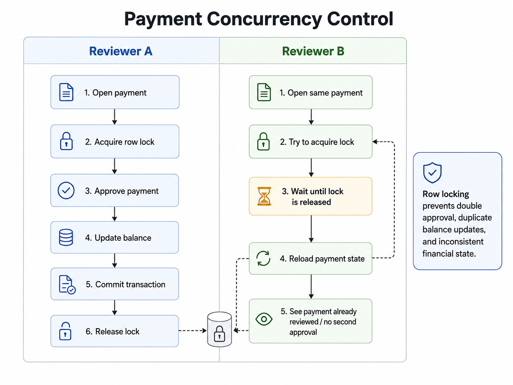
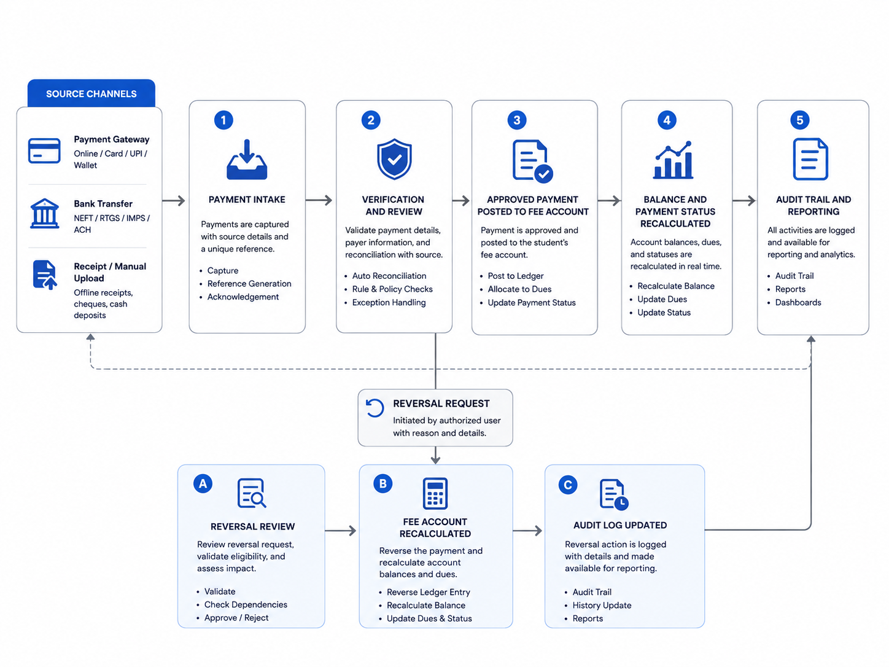

# Reliability & Security

This document explains the cross-cutting reliability and security decisions used to harden the Institutional Management Platform.

The individual business workflows are documented in [Core Workflows](./workflows.md). This document focuses on the protections that apply across those workflows: authentication, authorization, validation, database constraints, transactions, concurrency control, idempotency, auditability, storage access, and failure handling.

The main lesson from the hardening work was simple:

> A feature is not reliable just because the normal path works.

The system also needs defined behaviour when:

- the same request is submitted twice
- two users act on the same record at the same time
- one step in a multi-write operation fails
- an authenticated user attempts an unauthorized action
- required configuration is missing
- a financial transaction needs correction
- invalid state is sent directly to the backend

---

# Security Model

The platform uses several layers rather than relying on one control.

```text
User
 ↓
Authentication
 ↓
Authorization
 ↓
Request Validation
 ↓
Business-State Validation
 ↓
Database Constraints
 ↓
Transactional Operations
 ↓
Audit History
```

Each layer solves a different problem.

- Authentication establishes identity.
- Authorization decides whether that identity can perform the operation.
- API validation rejects malformed or unsupported requests.
- Database constraints prevent invalid persistent state.
- Transactions protect multi-step operations from partial success.
- Row locks protect shared state during concurrent operations.
- Audit fields preserve who changed sensitive state and when.

The platform does not assume that one of these layers can replace the others.

---

# Authentication

Authentication is handled through Supabase Auth.

Authentication answers:

> Who is making this request?

For sensitive server-side operations, the acting user is resolved from the authenticated session rather than from a user ID supplied by the client.

A request should not be trusted simply because it contains:

```json
{
  "reviewer_id": "some-profile-id"
}
```

The client controls that payload and can modify it.

The safer flow is:

```text
Request
   ↓
Authenticated Session
   ↓
Server Resolves User
   ↓
Resolved Identity Used for Audit / Authorization
```

This is especially important for operations such as payment review and payment reversal.

---

# Authorization

Authentication and authorization are deliberately separate.

Authentication asks:

> Who are you?

Authorization asks:

> Are you allowed to perform this operation?

A broad role is not always sufficient.

The financial review workflow is a concrete example.

Earlier access rules were too broad because a generic non-academic staff role could reach financial review actions. The authorization rule was tightened to consider the staff member's institutional responsibility.

```text
Authenticated User
        ↓
Profile Role
        ↓
Staff Record
        ↓
Institutional Unit
        ↓
Allowed Operation
```

For payment review, the accepted authorization path is:

```text
Administrator

or

Non-Academic Staff
        +
Bursary Unit
```

So:

```text
Logged in ≠ Authorized
```

and:

```text
Staff ≠ Authorized for every staff operation
```

## 401 vs 403

The API keeps authentication and authorization failures distinct.

```text
401
→ no valid authenticated identity

403
→ authenticated identity exists, but the action is not permitted
```

This makes failures easier to reason about and prevents access control from being reduced to a single generic error.

---

# Validation at Multiple Layers

Validation exists at different levels for different reasons.

## Frontend Validation

Frontend validation mainly improves user experience.

Examples:

```text
Required field missing
Invalid input format
Empty reversal reason
```

It provides immediate feedback, but it is not treated as the final authority because browser-side logic can be modified or bypassed.

## API Validation

The server validates the request before sensitive database logic runs.

Examples include:

- UUID format
- required request fields
- allowed actions
- rejection reason requirements
- reversal reason requirements
- authenticated user presence
- authorization for the requested operation

## Database Validation

The database protects the final state.

Examples include:

- one student registration per student/session
- one fee account per student registration
- one course enrolment per student/course offering
- valid foreign-key relationships
- valid payment states
- valid financial amounts

The model is:

```text
Frontend
→ friendly feedback

API / Server
→ request, authentication, and authorization checks

Database
→ final integrity guarantees
```

---

# Database Constraints

Database constraints are part of the application design, not just schema decoration.

They protect invariants even when the request does not pass through the expected UI.

## Application Uniqueness

The same admission request should not be created more than once.

```text
NIN
+
Programme
+
Academic Session
```

## Student Session Registration

A student is registered once per academic session.

```text
Student ID
+
Session ID
```

## Student Fee Account

A student registration has one fee account.

```text
Student Registration
        ↓
One Fee Account
```

## Course Enrolment

The same student should not be enrolled more than once in the same course offering.

```text
Student ID
+
Course Offering ID
```

## Financial Check Constraints

Financial records also need valid values and states.

Examples include:

```text
amount > 0
```

and known status values such as:

```text
pending
approved
rejected
reversed
```

Where state-specific audit requirements are enforced, the database should reject combinations that do not make sense.

The principle is:

> The API explains the rule. The database guarantees the invariant.

---

# Transactional Operations

Some actions involve several related writes that represent one business operation.

For example, payment approval can require:

```text
Validate payment state
        ↓
Update payment status
        ↓
Recalculate approved total
        ↓
Update account balance
        ↓
Update account payment status
        ↓
Write reviewer audit fields
```

If those steps happen as unrelated requests, partial failure can leave the platform inconsistent.

Example:

```text
Payment marked approved ✅
Account balance update fails ❌
```

That is not an acceptable final state.

## Atomicity

Critical multi-step workflows are therefore executed transactionally.

```text
BEGIN

Validate Current State
        ↓
Lock Shared State if Required
        ↓
Perform Related Changes
        ↓
Recalculate Dependent Values
        ↓
Write Audit Data

COMMIT
```

If a required step fails:

```text
ROLLBACK
```

The business operation either completes or does not.

## PostgreSQL Functions / RPCs

Transactional PostgreSQL functions are used where strong consistency is more important than keeping the entire workflow in application code.

Examples include:

- applicant-to-student conversion
- session registration with fee-account creation
- payment review
- payment reversal

The API remains responsible for:

```text
Authentication
        ↓
Authorization
        ↓
Request Validation
        ↓
Call Transactional Operation
        ↓
Return Controlled Response
```

The database function controls the atomic data changes.

---

# Race Condition Protection

Transactions do not automatically solve every concurrency problem.

A race condition occurs when multiple operations interact with the same state at nearly the same time and the final result depends on execution order.

For example:

```text
Remaining Balance = 1,000
```

Two reviewers may both read that value before either transaction updates it.

Without concurrency control, both operations could make decisions based on the same stale state.

## Row Locking

For sensitive shared state, PostgreSQL row locking is used:

```sql
SELECT ...
FOR UPDATE;
```

Conceptually:

```text
Reviewer A                     Reviewer B
    │                              │
    ▼                              ▼
Lock Payment / Account       Request Same State
    │                              │
    ▼                              ▼
Validate Current State             Wait
    │                              │
    ▼                              │
Apply Changes                      │
    │                              │
    ▼                              │
Commit / Release Lock ─────────────┘
                                   ↓
                           Re-read Current State
```



The lock is held inside the database because the database is where the shared state actually lives.

Disabling a button in the frontend can prevent one user's accidental double-click, but it cannot stop two reviewers on different devices from submitting at nearly the same time.

---

# Race Conditions vs Idempotency

Race conditions and idempotency solve different problems.

| Problem | Race Condition | Idempotency |
|---|---|---|
| Main concern | Concurrent operations | Repeated logical operation |
| Example | Two reviewers process the same payment at once | The same request is retried |
| Risk | Incorrect shared state | Duplicate processing |
| Typical protection | Row locks / state checks | Unique constraints / idempotency keys |
| Can both occur? | Yes | Yes |

A reliable workflow may need both.

---

# Idempotency and Duplicate Protection

Idempotency asks:

> What should happen when the same logical action is repeated?

The platform currently relies on business-level uniqueness and state validation for several important workflows.

Examples:

```text
NIN + Programme + Session
```

for applications,

```text
Student + Session
```

for academic registration, and

```text
Student + Course Offering
```

for course enrolment.

This prevents repeated requests from creating duplicate business records.

## Future Payment Gateway Idempotency

External payment providers may retry events or webhook delivery.

If a gateway is integrated later, the provider's transaction or event identifier should be stored with a unique constraint.

```text
Gateway Event
     ↓
Provider Transaction ID
     ↓
Already Processed?
   ↙             ↘
 Yes             No
 ↓               ↓
Return         Process
Existing       Event
Result
```

This is a future integration requirement, not a claim that gateway webhook processing is already implemented.

---

# Financial State as Derived Data

The platform does not treat stored financial totals as values that should be blindly incremented forever.

Approved payment records are the underlying financial events.

Summary values such as:

```text
Approved Paid
Balance Due
Payment Status
```

are derived from that history.

For payment approval and reversal, the approved total is recalculated from payments that remain in the approved state.

```text
Approved Payments
       ↓
SUM(approved amounts)
       ↓
Approved Paid
       ↓
Annual Fee - Approved Paid
       ↓
Balance Due
       ↓
Payment Status
```

This reduces the risk of stored totals drifting away from the payment history.



---

# Overpayment Protection

The current financial workflow does not support credit balances.

If:

```text
Balance Due = 20,000
Submitted Payment = 25,000
```

the approval is rejected.

Supporting overpayment properly would require additional business concepts such as:

- credit balances
- refunds
- carry-forward rules
- allocation rules
- possibly a separate financial ledger model

Rejecting overpayment is therefore a deliberate scope decision rather than silently introducing unsupported financial behaviour.

---

# Payment State Transitions

Not every payment state can transition to every other state.

The valid review path is:

```text
Pending
  ├────────→ Approved
  └────────→ Rejected

Approved
  ↓
Reversed
```

Examples of invalid transitions include:

```text
Approved → Approved again
Reversed → Reversed again
Rejected → Approved through the original review action
```

The database operation validates the current state before changing it.

This prevents an old or repeated request from silently applying a transition that is no longer valid.

---

# Auditability

Sensitive workflows need more than a final status.

The system should be able to answer:

```text
Who performed this?
When?
Why?
What state did it come from?
Was it later corrected?
```

Financial records preserve audit fields such as:

- `verified_by`
- `verified_at`
- `rejected_by`
- `rejected_at`
- review remarks
- `reversed_by`
- `reversed_at`
- reversal reason

The acting user is derived from the authenticated server-side identity for sensitive operations.

---

# Controlled Reversal Instead of Deletion

An approved financial event should not disappear because it later needs correction.

The platform distinguishes between:

```text
Removing a non-final record
```

and:

```text
Correcting historical financial state
```

Approved payments are corrected through reversal.

```text
Approved Payment
       ↓
Correction Required
       ↓
Validate Current State
       ↓
Require Reversal Reason
       ↓
Lock Payment / Account
       ↓
Mark Payment Reversed
       ↓
Recalculate Approved Total
       ↓
Recalculate Balance
       ↓
Store Reversal Audit
```

The original payment remains.

The original approval remains.

The reversal adds new history.

## Deletion Rules

Financial records are treated according to state.

```text
Pending  → deletion may be allowed
Rejected → deletion may be allowed
Approved → ordinary deletion blocked
Reversed → ordinary deletion blocked
```

Approved and reversed records remain part of the financial history.

---

# Server-Side Privileged Access

Sensitive administrative operations can require privileged Supabase access.

The service-role client belongs on the server and must never be exposed in browser code or a `NEXT_PUBLIC_...` environment variable.

```text
Browser
→ user-scoped access

Server
→ privileged access where explicitly required
```

Because the service role can bypass normal Row Level Security restrictions, a privileged route must first perform:

```text
Authenticate
     ↓
Authorize
     ↓
Validate
     ↓
Privileged Database Operation
```

Moving privileged access to the server does not remove the need for authorization.

---

# Row Level Security

Row Level Security can provide an additional database-level access boundary.

For example, a student-facing policy could restrict financial access to:

```text
Authenticated Student
        ↓
Own Student Record
        ↓
Own Registration
        ↓
Own Fee Account
```

However, RLS coverage should not be described as complete where the current application still depends on client-side Supabase access or unrestricted policies.

## Why RLS Should Not Be Enabled Blindly

Enabling RLS before understanding the application's access paths can break legitimate workflows.

A safer hardening sequence is:

```text
Understand Current Access Paths
        ↓
Move Sensitive Writes Behind Server APIs
        ↓
Define Policies
        ↓
Enable / Tighten RLS
        ↓
Test Every Role
```

RLS complements server-side authorization.

It does not replace it.

Full RLS coverage remains part of the platform's ongoing security hardening.

---

# Storage Security

Uploaded files can contain sensitive institutional information.

Examples include:

- application documents
- supporting documents
- payment receipt evidence

Possessing a file URL should not automatically grant access to a sensitive document.

The preferred model for sensitive files is:

```text
Private Storage
      ↓
Authorized Request
      ↓
Signed / Controlled Access
```

rather than unrestricted public URLs.

Storage policy remains an area that should continue to be reviewed as the platform is hardened.

---

# Failure Cases Considered

Reliability work focused on failure paths, not only normal success cases.

## Duplicate Application

```text
Same NIN
Same Programme
Same Session
→ duplicate rejected
```

## Duplicate Session Registration

```text
Same Student
Same Session
→ duplicate rejected
```

## Missing Fee Plan During Single Registration

```text
Fee Plan Missing
→ registration fails
→ incomplete fee state avoided
```

## Missing Fee Plan During Bulk Registration

```text
Affected Student
→ skipped
→ reason returned
→ remaining valid students continue
```

## Partial Payment Approval Failure

```text
Payment update succeeds
Account update fails
```

Prevented by keeping the financial review workflow inside one transaction.

## Concurrent Payment Review

```text
Reviewer A
+
Reviewer B
→ same shared payment/account state
```

Protected through row locking and state validation.

## Repeated Approval

```text
Approved Payment
→ approve again
```

Rejected because the payment is no longer pending.

## Unsupported Overpayment

```text
Submitted Amount
>
Remaining Balance
```

Rejected by the current financial model.

## Financial Correction

```text
Approved Payment
→ later found incorrect
```

Handled through reversal rather than deletion.

---

# Trade-offs

The hardening work does not move every rule into PostgreSQL.

That would make ordinary application logic unnecessarily difficult to maintain.

It also does not leave every rule in React or API routes, because application-layer checks alone cannot guarantee database consistency.

Responsibility is split deliberately:

| Layer | Responsibility |
|---|---|
| Frontend | User experience and immediate feedback |
| API / Server | Authentication, authorization, request validation |
| Database Constraints | Permanent data invariants |
| Transactional RPCs | Atomic multi-step operations |
| Row Locks | Shared-state concurrency protection |
| Audit Fields | Historical accountability |
| Storage Policies | File-access boundaries |

The main trade-offs are:

### Row locking vs optimistic concurrency

Row locking is simpler to reason about and provides strong protection for low-frequency sensitive operations such as payment review.

The cost is that competing transactions may wait.

That trade-off is acceptable here because correctness matters more than maximizing payment-review throughput.

### Recalculation vs incremental totals

Recalculating approved totals performs more database work than simply adding or subtracting from a stored total.

The benefit is that the account summary remains tied to the approved payment history.

### Reversal vs mutation

Reversal creates more state than directly editing an approved payment.

The benefit is that the historical approval remains traceable.

### Overpayment rejection vs credit support

Rejecting overpayment keeps the current model simpler.

Supporting credits would require additional rules for refunds, carry-forward balances, allocation, and account settlement.

### Database RPC vs application-layer transaction

Transactional database functions place sensitive multi-step operations close to the data and make locking straightforward.

The cost is that some business logic now lives in SQL rather than only in TypeScript.

For workflows where atomicity and concurrency protection matter, that trade-off is intentional.

---

# Remaining Security Considerations

The hardening phase improved the platform substantially, but several areas should continue to be reviewed.

These include:

- Full RLS coverage for user-facing data access
- Private storage and controlled file access
- Rate limiting on sensitive endpoints
- Gateway webhook authentication and idempotency if external payments are added
- Automated authorization and database integrity tests
- Monitoring and alerting
- Structured security/audit event logging
- Backup and recovery procedures
- Secret rotation
- Dependency and security scanning

These are remaining hardening areas, not features that should be presented as already complete.

---

# Key Lessons

The main reliability and security lessons from the platform were:

1. Authentication does not imply authorization.
2. Frontend validation cannot protect the database by itself.
3. Database constraints are part of application design.
4. Transactions prevent partial multi-step business operations.
5. Race conditions and idempotency solve different problems.
6. Concurrency protection belongs close to shared state.
7. Financial summaries should remain consistent with their underlying events.
8. Sensitive operations need auditable actor and timestamp information.
9. Financial corrections should preserve history.
10. Security works best as a set of complementary layers.

---

# Related Documentation

For the overall system design:

[Architecture →](./architecture.md)

For the business workflows:

[Core Workflows →](./workflows.md)

For deeper engineering examples:

- [Platform Hardening Case Study](./case-studies/platform-hardening.md)
- [Registration Integrity Case Study](./case-studies/registration-integrity.md)
- [Financial Workflow Case Study](./case-studies/financial-workflow.md)
