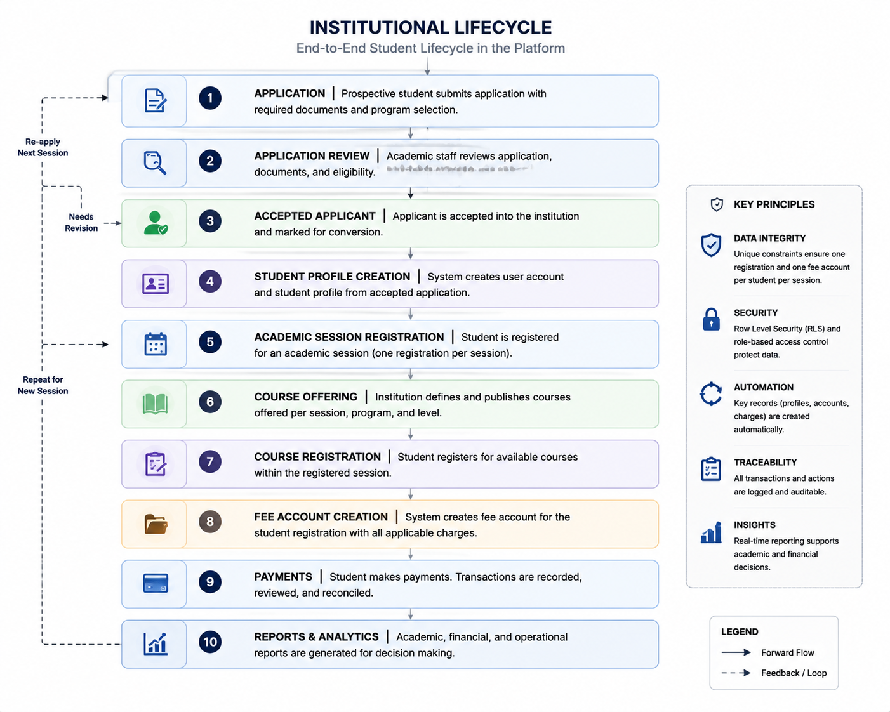
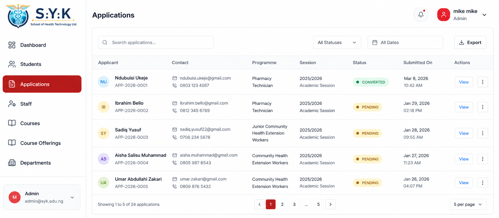
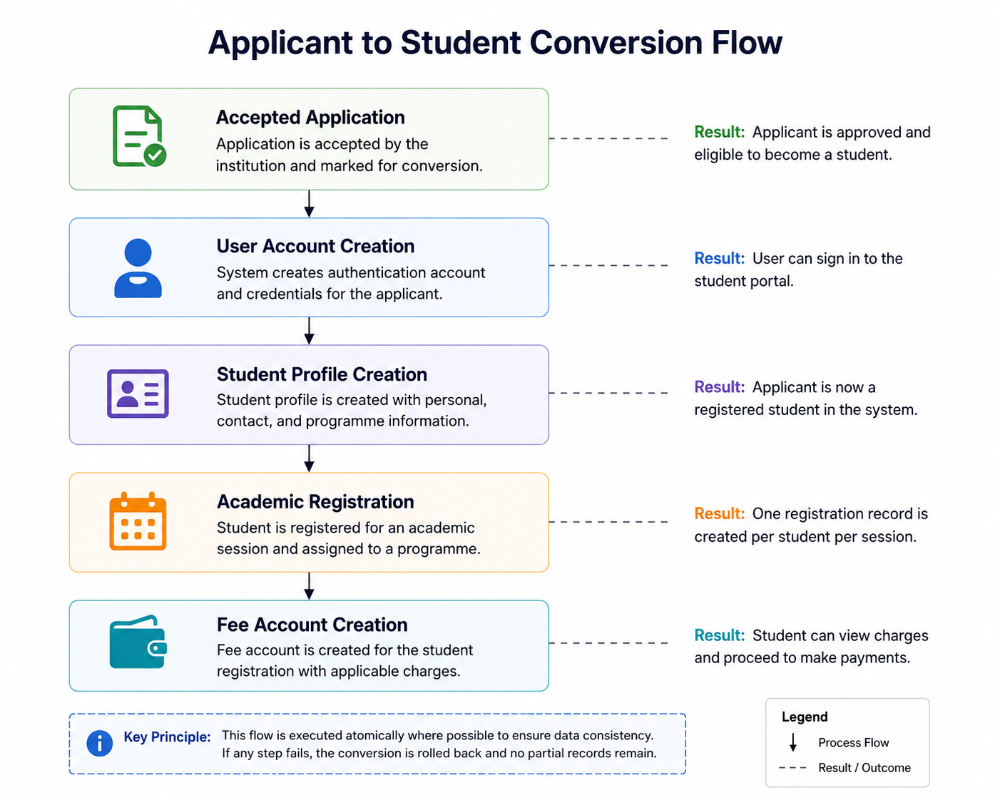
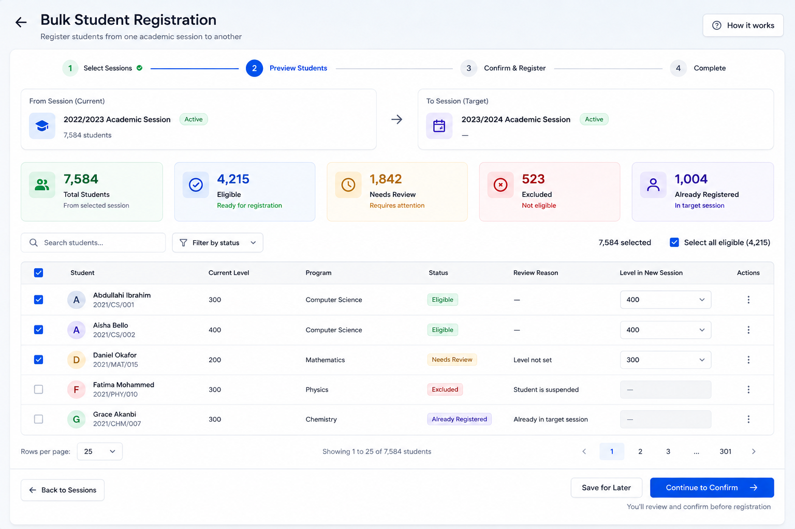
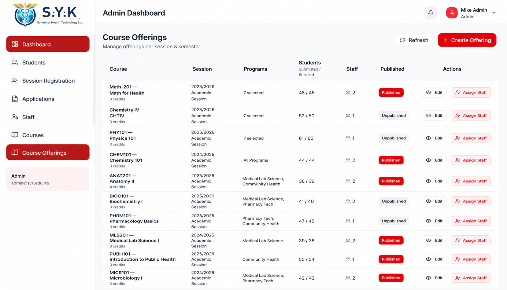

# Core Workflows

This document describes the main end-to-end workflows inside the Institutional Management Platform.

The platform is not designed as a collection of isolated CRUD modules. Most operations depend on records created earlier in the institutional lifecycle.

At a high level:

```text
Application
    ↓
Review
    ↓
Admission Decision
    ↓
Applicant → Student Conversion
    ↓
Academic Session Registration
    ├──────────────┐
    ↓              ↓
Fee Account    Course Registration
    ↓
Payment Operations
```



---

# Applications and Application Review

## Purpose

The application workflow manages a person before they become an active student.

An application represents an applicant's request to join a programme during a particular academic session. It remains separate from the student record until the admission process is complete.

## Main Flow

```text
Applicant
    ↓
Choose Programme
    ↓
Choose Academic Session
    ↓
Submit Application
    ↓
Provide Required Information / Documents
    ↓
Application Created
    ↓
Authorized Staff Review
    ↓
Admission Decision
```



## Important Rules

An application is tied to the applicant's identity, programme, and academic session.

The database protects against duplicate applications for the same logical combination:

```text
NIN
+
Programme
+
Academic Session
```

This means the same applicant cannot create multiple applications for the same programme in the same academic session, even if the request is submitted more than once.

## Application Review

Authorized staff review submitted applications and make an admission decision.

Before an application can move to an accepted or rejected state, the workflow checks that the application is in a valid review state and that the reviewer is permitted to perform the action.

```text
Submitted Application
        ↓
Authorized Review
        ↓
 ┌──────┴──────┐
 ↓             ↓
Accepted     Rejected
```

An accepted application becomes eligible for conversion into a student.

A rejected application remains an application record and may be eligible for a future application in a later academic session, depending on the applicable reapplication rules.

---

# Applicant to Student Conversion

## Purpose

Accepting an application does not by itself create the records required to manage the applicant as an active student.

The conversion workflow creates the institutional records needed to move an accepted applicant into the student system.

## Main Flow

```text
Accepted Application
        ↓
Profile / User
        ↓
Student Record
        ↓
Initial Session Registration
        ↓
Student Fee Account
```



## What Happens During Conversion

The conversion performs one logical business operation:

1. Confirm that the application is accepted and eligible for conversion.
2. Create or connect the required profile/user record.
3. Create the student record.
4. Create the student's initial academic-session registration.
5. Locate the programme fee plan for that session.
6. Create the student's fee account from that fee plan.

The workflow is designed to avoid leaving the system in a partially converted state.

For example, a student record should not be created successfully while the required registration or fee account is missing.

## Fee Account Creation

The student's initial fee account is based on the programme fee plan configured for the student's programme and academic session.

```text
Programme
    +
Academic Session
    ↓
Programme Fee Plan
    ↓
Annual Fee
    ↓
Student Fee Account
```

The account begins with:

```text
Approved Paid = 0
Balance Due   = Annual Fee
Payment State = Unpaid
```

---

# Academic Sessions

Academic sessions represent complete academic years.

For example:

```text
2025 / 2026
```

A session contains semester-specific activity rather than requiring a separate session record for each semester.

```text
Academic Session
      ↓
 ┌────┴────┐
 ↓         ↓
First    Second
Semester Semester
```

A student is registered once for the academic session.

Course offerings and course registration remain semester-specific within that session.

---

# Single Session Registration

## Purpose

Single session registration is used when one existing student needs to be registered into a new academic session.

The operation creates both the student's academic registration for that year and the related fee account.

## Main Flow

```text
Select Student
      ↓
Select Target Session
      ↓
Validate Student
      ↓
Validate Target Session
      ↓
Check Existing Registration
      ↓
Find Programme Fee Plan
      ↓
Create Student Registration
      ↓
Create Student Fee Account
      ↓
Return Successful Registration
```

## Important Rules

### One registration per student per academic session

A student must not have more than one registration for the same academic year.

The database protects the combination:

```text
Student ID
+
Session ID
```

### A valid fee plan is required

Before a registration is created, the workflow checks for a programme fee plan matching the student's programme and target session.

If the required fee plan is missing, the operation fails for that student.

```text
Fee Plan Missing
      ↓
Registration Fails
```

The system does not intentionally create an academic registration without the fee account required for that registration.

## Atomic Behaviour

Registration creation and fee-account creation belong to the same business operation.

The expected result is:

```text
Registration Created
+
Fee Account Created
```

or:

```text
Nothing Created
```

not:

```text
Registration Created
Fee Account Missing
```

The transactional behaviour behind this is covered in:

[Reliability & Security →](./reliability-and-security.md#transactional-operations)

---

# Bulk Session Registration

## Purpose

Bulk session registration allows multiple eligible students to be processed for a target academic session in one operation.

Unlike single registration, one student failing validation should not automatically prevent every other valid student in the batch from being registered.

## Main Flow

```text
Select Students
      ↓
Choose Target Session
      ↓
Process Each Student
      ↓
 ┌────┴──────────────────────────────┐
 ↓                                   ↓
Already Registered /           Valid Student
Missing Fee Plan                    ↓
 ↓                             Create Registration
Skip Student                         ↓
 ↓                             Create Fee Account
Return Reason                        ↓
 ↓                                Continue
Continue
```



## Per-Student Behaviour

Each selected student is processed independently.

For a valid student:

```text
No Existing Registration
        ↓
Fee Plan Exists
        ↓
Registration Created
        ↓
Fee Account Created
```

If the student is already registered for the target session, or if the required fee plan is missing, that student is skipped and the reason is returned.

For example:

> No fee plan is configured for the student's programme and target session.

The rest of the batch continues processing.

## Why Single and Bulk Behaviour Differ

For a single operation, the caller asked the system to register one specific student. If that student cannot be registered correctly, failing the operation is the appropriate result.

For a batch, one invalid student should not necessarily block all other valid students.

```text
20 Students Selected
        ↓
19 Valid
1 Invalid
        ↓
19 Processed
1 Skipped with Reason
```

This is deliberate business behaviour rather than an accidental side effect of the implementation.

---

# Courses and Course Offerings

## Purpose

The platform separates the permanent course catalogue from the period-specific availability of those courses.

## Course

A course represents the academic subject itself.

Typical course information includes:

```text
Course Code
Course Title
Credits
Programme
Academic Level
```

A course existing in the catalogue does not automatically make it available for student registration.

## Course Offering

A course offering represents a specific instance in which a course is available to students.

An offering includes information such as:

- Course
- Academic session
- Semester
- Programme
- Academic level
- Lecturer assignment
- Publication status

```text
Course
   ↓
Academic Session
   ↓
Semester
   ↓
Programme / Level
   ↓
Lecturer Assignment
   ↓
Course Offering
   ↓
Published
```



## Why They Are Separate

The permanent course record should not be duplicated every time the course is taught.

For example:

```text
CSC401
```

can remain one course while separate offerings represent:

```text
CSC401
2025/2026
First Semester
Programme A
Lecturer X
```

and later:

```text
CSC401
2026/2027
First Semester
Programme A
Lecturer Y
```

The course remains the permanent academic definition, while the offering represents when, where, and by whom it is delivered.

---

# Course Registration

## Purpose

Course registration allows students to enrol in published course offerings that match their current academic context.

## Availability Flow

Available offerings are determined from the student's active academic information:

```text
Student
   ↓
Current Session Registration
   ↓
Programme
   ↓
Level
   ↓
Academic Session
   ↓
Current Semester
   ↓
Published Course Offerings
```

## Registration Flow

```text
Student Opens Registration
        ↓
Eligible Offerings Loaded
        ↓
Student Selects Courses
        ↓
Server Validates Selection
        ↓
Enrolment Records Created
        ↓
Registered Courses Returned
```

## Important Rules

A student must not enrol more than once in the same course offering.

The database protects the relationship:

```text
Student
+
Course Offering
```

The server also validates that the selected offering is actually available to the student's programme, level, session, and semester.

A course existing in the catalogue alone is not sufficient.

---

# Fee Accounts and Payment Operations

## Fee Account Purpose

A student's financial position is tied to their academic-session registration.

This keeps the financial state for one academic year separate from another.

```text
Student
   ↓
Student Registration
   ↓
Student Fee Account
```

Each account tracks values such as:

- Annual fee
- Approved amount paid
- Outstanding balance
- Payment status

## Fee Plan Source

The expected annual fee comes from the programme fee plan configured for the student's programme and academic session.

```text
Programme
+
Academic Session
      ↓
Programme Fee Plan
      ↓
Student Fee Account
```

The fee account stores the fee applicable to that specific student registration.

---

# Payment Submission and Review

## Current Payment Entry

The current implementation uses receipt-based payment submission followed by authorized financial review.

Future payment sources, such as a payment gateway or bank-confirmed transaction, can be integrated into the same downstream validation, account-update, and audit workflow without changing the core financial model.

```text
Payment Receipt
      ↓
Identify Fee Account
      ↓
Validate Payment State
      ↓
Authorized Review
      ↓
 ┌────┴────┐
 ↓         ↓
Approve   Reject
 ↓
Recalculate Account
 ↓
Preserve Audit History
```


## Approval

When an authorized reviewer approves a payment:

1. The payment must still be pending.
2. The related fee account is loaded.
3. The submitted amount is checked against the remaining balance.
4. Overpayment is rejected by the current workflow.
5. The payment is marked as approved.
6. The approved total is recalculated from payments that remain in the approved state.
7. The outstanding balance is recalculated from that approved total.
8. The account payment status is updated.
9. Reviewer identity and review timestamp are preserved.

The approved amount is the validated submitted amount. Reviewers do not manually replace it with a different figure during approval.

## Rejection

A rejected payment requires a reason.

The workflow records:

- Rejected status
- Reviewer identity
- Rejection timestamp
- Review remarks

A rejected payment does not contribute to the account's approved payment total.

---

# Controlled Payment Reversal

## Purpose

A payment may be correctly approved and later require correction.

Deleting or rewriting the original financial event would remove important history, so approved payments are corrected through reversal instead.

## Flow

```text
Approved Payment
       ↓
Correction Required
       ↓
Provide Reversal Reason
       ↓
Validate Reversal Request
       ↓
Mark Payment as Reversed
       ↓
Exclude from Approved Total
       ↓
Recalculate Account Balance
       ↓
Preserve Approval + Reversal Audit
```

## Preserved Information

A reversed payment keeps its original approval information and adds:

- Who reversed the payment
- When the reversal occurred
- Why the payment was reversed

This makes the correction traceable without rewriting historical financial actions.

## Deletion Rules

Financial records are treated according to their state.

```text
Pending  → deletion may be allowed
Rejected → deletion may be allowed
Approved → deletion blocked
Reversed → deletion blocked
```

Approved and reversed records remain part of the financial history and are protected from ordinary deletion.

---

# How the Workflows Connect

The platform's domains depend on one another.

```text
Application
     ↓
Admission Review
     ↓
Applicant Conversion
     ↓
Student
     ↓
Academic Registration
     ├──────────────┐
     ↓              ↓
Fee Account     Course Registration
     ↓
Payment Operations
```

A change in one domain can affect records and rules in another.

---

# Related Documentation

For the system structure and boundaries:

[Architecture →](./architecture.md)

For the rules that protect these workflows:

[Reliability & Security →](./reliability-and-security.md)

For deeper engineering examples:

- [Platform Hardening Case Study](./case-studies/platform-hardening.md)
- [Registration Integrity Case Study](./case-studies/registration-integrity.md)
- [Financial Workflow Case Study](./case-studies/financial-workflow.md)
