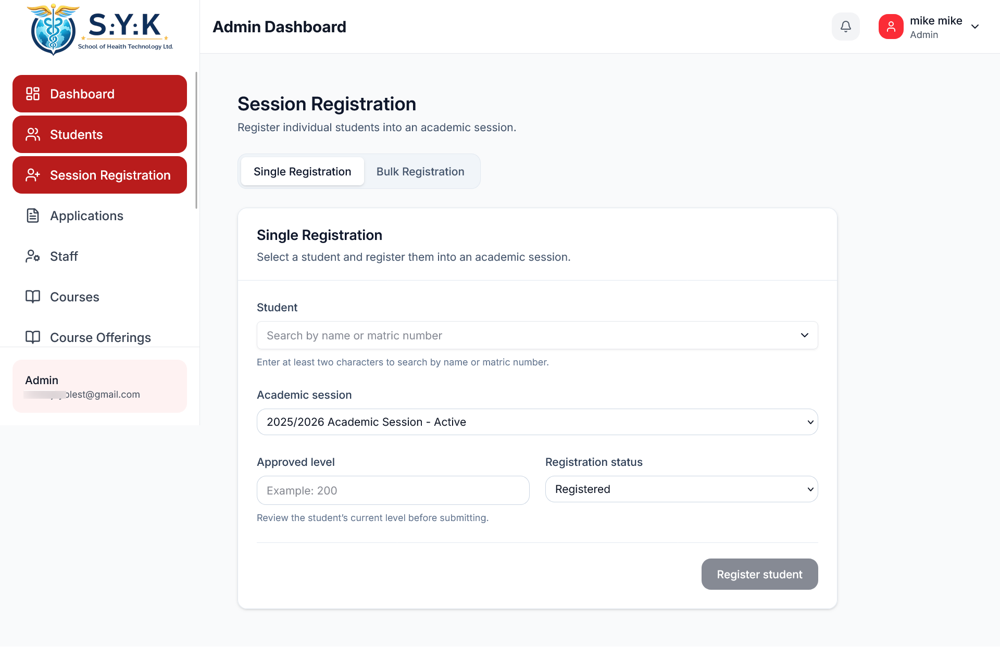
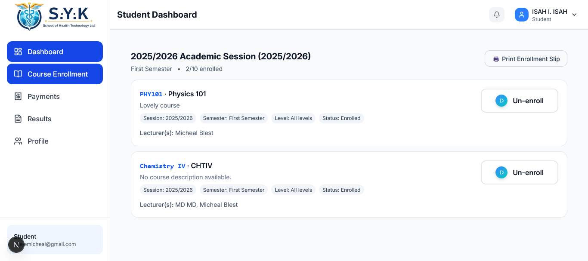

# Core Workflows

This document describes the main end-to-end workflows inside the Institutional Management Platform.

The platform is not designed as a collection of isolated CRUD modules. Most operations depend on records created earlier in the institutional lifecycle.

At a high level:

```text
Application
    ↓
Review
    ↓
Admission Decision
    ↓
Applicant → Student Conversion
    ↓
Academic Session Registration
    ↓
Fee Account
    ↓
Course Registration
    ↓
Ongoing Academic & Financial Operations
```

<!-- IMAGE PLACEHOLDER: Core institutional workflow -->


---

# Applications and Application Review

## Purpose

The application workflow manages a person before they become an active student.

An application represents an applicant's request to join a programme during a particular academic session.

It remains separate from the student record until the admission process is complete.

---

## Main Flow

```text
Applicant
    ↓
Choose Programme
    ↓
Choose Academic Session
    ↓
Submit Application
    ↓
Provide Required Information / Documents
    ↓
Application Created
    ↓
Staff Review
    ↓
Admission Decision
```

<!-- IMAGE PLACEHOLDER: Applications / review screenshot -->


---

## Important Rules

An application is tied to:

- Applicant identity
- Programme
- Academic session

The platform protects against duplicate applications for the same logical combination.

For example, the same applicant should not be able to create multiple applications for the same programme during the same academic session.

At the database level, the logical uniqueness is based on:

```text
Applicant Identity
+
Programme
+
Academic Session
```

This protects the workflow even if the same request is submitted more than once.

---

## Application Review

Authorized staff review applications and make an admission decision.

The review process is more than simply changing a status field.

The current application state, supporting information, reviewer permissions, and intended transition all matter.

A simplified flow is:

```text
Submitted Application
        ↓
Review
        ↓
 ┌──────┴──────┐
 ↓             ↓
Accepted     Rejected
```

An accepted application becomes eligible for conversion into a student.

A rejected application remains an application record and can follow whatever future reapplication rules apply to a later academic session.

---

# Applicant to Student Conversion

## Purpose

Accepting an application does not by itself create all the records needed to manage the person as a student.

The conversion workflow turns an accepted applicant into the related institutional records required for active student management.

---

## Main Flow

```text
Accepted Application
        ↓
Profile / User
        ↓
Student Record
        ↓
Initial Student Registration
        ↓
Student Fee Account
```

<!-- IMAGE PLACEHOLDER: Applicant conversion -->


---

## What Happens During Conversion

The conversion workflow creates or connects the records required for the student's new institutional identity.

This includes:

1. Confirming that the application is eligible for conversion.
2. Creating the required profile/user information.
3. Creating the student record.
4. Creating the initial academic-session registration.
5. Finding the programme fee plan for that session.
6. Creating the student's fee account.

These operations represent one logical business action.

The platform therefore avoids treating them as completely independent steps.

---

## Fee Account Creation

The student's initial fee account is based on the programme fee plan for the relevant academic session.

Conceptually:

```text
Programme
    +
Academic Session
    ↓
Programme Fee Plan
    ↓
Annual Fee
    ↓
Student Fee Account
```

The account begins with:

```text
Approved Paid = 0
Balance Due   = Annual Fee
Payment State = Unpaid
```

---

# Academic Sessions

Academic sessions represent complete academic years.

For example:

```text
2025 / 2026
```

A session contains semester-specific activity rather than requiring a new session record for each semester.

```text
Academic Session
      ↓
 ┌────┴────┐
 ↓         ↓
First    Second
Semester Semester
```

Student session registration therefore happens once for the academic year.

Course offerings and course registration can still remain semester-specific.

---

# Single Session Registration

## Purpose

Single session registration is used when one existing student needs to be registered into an academic session.

This creates the student's academic registration for that year and the related fee account.

---

## Main Flow

```text
Select Student
      ↓
Select Target Session
      ↓
Validate Student / Session
      ↓
Check Existing Registration
      ↓
Find Programme Fee Plan
      ↓
Create Student Registration
      ↓
Create Student Fee Account
      ↓
Return Successful Registration
```

<!-- IMAGE PLACEHOLDER: Single registration -->



---

## Important Rules

### One registration per student per academic session

A student should not have multiple registrations for the same academic year.

The database protects:

```text
Student ID
+
Session ID
```

as a unique combination.

---

### A valid fee plan is required

Before creating the registration, the workflow checks for the programme's fee plan in the target academic session.

If the required fee plan does not exist:

```text
Registration
    ↓
Fails
```

The system does not intentionally create a registration and leave it without the expected fee account.

---

## Atomic Behaviour

Registration and fee-account creation belong to the same business operation.

The intended outcome is therefore either:

```text
Registration Created
+
Fee Account Created
```

or:

```text
Nothing Created
```

rather than:

```text
Registration Created
Fee Account Missing
```

The detailed transactional behaviour is covered in:

[reliability-and-security.md](./reliability-and-security.md#transactional-operations)

---

# Bulk Session Registration

## Purpose

Bulk session registration allows multiple eligible students to be registered for a new academic session in one operation.

The workflow cannot behave exactly like single registration because one invalid student should not necessarily prevent every valid student from being processed.

---

## Main Flow

```text
Select Students
      ↓
Choose Target Session
      ↓
Process Each Student
      ↓
 ┌────┴─────────────────────┐
 │                          │
Valid                     Invalid
 │                          │
 ↓                          ↓
Check Fee Plan           Skip Student
 │                          │
 ↓                          ↓
Create Registration     Record Reason
 │
 ↓
Create Fee Account
 │
 ↓
Continue
```

<!-- IMAGE PLACEHOLDER: Bulk registration -->


---

## Per-Student Behaviour

Each selected student is evaluated independently.

For a valid student:

```text
Valid Academic Context
        ↓
Fee Plan Exists
        ↓
Registration Created
        ↓
Fee Account Created
```

If required configuration is missing:

```text
Fee Plan Missing
       ↓
Student Skipped
       ↓
Reason Returned
       ↓
Continue Processing Others
```

One example reason is:

> No fee plan is configured for the student's programme and target session.

---

## Why Single and Bulk Behaviour Differ

For a single operation, the caller asked the system to register one specific student.

If that student cannot be registered correctly, failing the operation makes sense.

For a batch:

```text
20 Students Selected
```

one invalid record should not necessarily prevent the other 19 valid students from being processed.

This is a deliberate business decision rather than an implementation accident.

---

# Courses and Course Offerings

## Purpose

The platform separates the permanent course catalogue from the period-specific availability of those courses.

This distinction became important as the academic model evolved.

---

## Course

A course describes the academic subject itself.

For example:

```text
Course Code
Course Title
Credits
Programme
Academic Level
```

A course does not automatically mean students can register for it during the current semester.

---

## Course Offering

A course offering describes a specific instance in which that course becomes available.

An offering can include:

- Course
- Academic session
- Semester
- Programme
- Academic level
- Lecturer assignment
- Publication status

Conceptually:

```text
Course
   ↓
Academic Session
   ↓
Semester
   ↓
Programme / Level
   ↓
Lecturer
   ↓
Course Offering
   ↓
Published
```

<!-- IMAGE PLACEHOLDER: Course offerings -->


---

## Why They Are Separate

Without this separation, the institution might need to duplicate the main course record every time it is taught again.

Instead:

```text
CSC401
```

can remain one course while different offerings represent:

```text
CSC401
2025/2026
First Semester
Programme A
Lecturer X
```

and later:

```text
CSC401
2026/2027
First Semester
Programme A
Lecturer Y
```

The permanent academic concept remains separate from the academic period in which it is delivered.

---

# Course Registration

## Purpose

Course registration allows students to enrol in the published course offerings available to their current academic context.

---

## Availability Flow

The platform determines relevant offerings from information such as:

```text
Student
   ↓
Current Academic Registration
   ↓
Programme
   ↓
Level
   ↓
Academic Session
   ↓
Current Semester
   ↓
Published Course Offerings
```

<!-- IMAGE PLACEHOLDER: Student course registration -->



---

## Registration Flow

```text
Student Opens Registration
        ↓
Available Offerings Loaded
        ↓
Student Selects Courses
        ↓
Server Validates Request
        ↓
Enrolment Records Created
        ↓
Registered Courses Returned
```

---

## Important Rules

Students should not enrol twice into the same course offering.

The database protects the logical relationship between:

```text
Student
+
Course Offering
```

The platform also relies on the course-offering model to determine whether a course is actually available for registration.

A course existing in the catalogue alone is not enough.

---

# Fee Accounts and Payment Operations

## Fee Account Purpose

A student's financial position is tied to their academic-session registration.

This prevents fees from different academic years from being mixed into one permanent balance.

The relationship is:

```text
Student
   ↓
Student Registration
   ↓
Student Fee Account
```

Each account tracks information such as:

- Annual fee
- Approved amount paid
- Outstanding balance
- Payment status

---

## Fee Plan Source

The expected annual fee comes from the programme fee plan.

```text
Programme
+
Academic Session
      ↓
Programme Fee Plan
      ↓
Student Fee Account
```

The fee account stores the applicable fee for that student's registration.

---

# Payment Events

At the business level, a payment is treated as a financial event that needs to be connected to the correct account.

Payment events can conceptually originate through channels such as:

```text
Payment Gateway
Bank Transfer
Institution-Managed Entry
Other Validated Sources
```

The current implementation includes receipt-based payment review.

The downstream financial concerns remain the same regardless of how the payment entered the institution:

```text
Payment Event
      ↓
Identify Account
      ↓
Validate
      ↓
Authorize
      ↓
Process
      ↓
Update Financial State
      ↓
Preserve Audit History
```

<!-- IMAGE PLACEHOLDER: Payment workflow -->


---

# Payment Review

Where human review is required, the payment begins in a pending state.

```text
Pending
   ↓
 ┌─┴────────────┐
 ↓              ↓
Approved      Rejected
```

An approved payment can later be corrected through reversal:

```text
Approved
   ↓
Reversed
```

---

## Approval

When an authorized reviewer approves a payment:

1. The payment must still be pending.
2. The related fee account is loaded.
3. The submitted payment is checked against the remaining balance.
4. Overpayment is rejected by the current workflow.
5. The payment is approved.
6. Approved payment totals are recalculated.
7. The account balance is recalculated.
8. The account payment status is updated.
9. Reviewer and timestamp information are preserved.

The approved amount matches the validated submitted amount.

The reviewer does not manually change the value during approval.

---

## Rejection

A payment can also be rejected.

A rejection requires a reason.

The workflow stores:

- Rejected status
- Reviewer identity
- Rejection timestamp
- Review remarks

A rejected payment does not change the approved financial balance.

---

# Controlled Payment Reversal

## Purpose

A financial transaction can be validly approved and later discovered to require correction.

Deleting the original transaction would remove important financial history.

The platform therefore uses a reversal workflow.

---

## Flow

```text
Approved Payment
       ↓
Correction Required
       ↓
Provide Reversal Reason
       ↓
Reverse Payment
       ↓
Recalculate Approved Total
       ↓
Recalculate Balance
       ↓
Preserve Original Approval
```

<!-- IMAGE PLACEHOLDER: Payment reversal -->


---

## Preserved Information

A reversed payment retains the original approval information.

It also records:

- Who reversed the payment
- When it was reversed
- Why it was reversed

This makes the correction traceable.

---

## Deletion Rules

Financial records are not all treated equally.

Pending or rejected records can be removable where appropriate.

Approved and reversed records are protected from ordinary deletion because they form part of the financial history.

```text
Pending  → deletion may be allowed
Rejected → deletion may be allowed

Approved → deletion blocked
Reversed → deletion blocked
```

---

# How the Workflows Connect

The important part of the platform is not any single module.

It is the relationship between them.

```text
Application
     ↓
Admission Review
     ↓
Applicant Conversion
     ↓
Student
     ↓
Academic Registration
     ├──────────────┐
     ↓              ↓
Fee Account     Course Registration
     ↓
Payment Operations
```

A change in one domain can affect another.

That is why the platform's business workflows are documented separately from individual pages and components.

---

# Related Documentation

For the system structure and boundaries:

[Architecture →](./architecture.md)

For the rules that protect these workflows:

[Reliability & Security →](./reliability-and-security.md)

For deeper engineering examples:

- [Platform Hardening Case Study](./case-studies/platform-hardening.md)
- [Registration Integrity Case Study](./case-studies/registration-integrity.md)
- [Financial Workflow Case Study](./case-studies/financial-workflow.md)